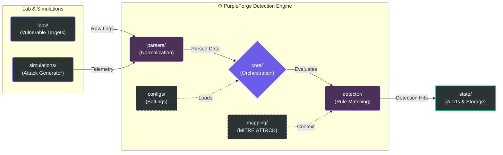

# PurpleForge -- Detection Engine Architecture

PurpleForge is a modular detection engineering framework designed for
controlled laboratory environments.\
It enables security engineers to simulate adversarial activity and test
detection rules in a safe, isolated setup.

This project is intended strictly for educational and laboratory use
only.\
Do NOT use against production systems or environments without explicit
authorization.

------------------------------------------------------------------------

## Project Purpose

PurpleForge is built to:

-   Simulate attack telemetry in controlled and intentionally vulnerable lab environments (for education/research only)
-   Test and validate detection rules
-   Experiment with rule engine architecture
-   Support threat modeling and security research workflows
-   Demonstrate how intentionally vulnerable lab environments can be safely hardened and improved

The focus of this project is **Security Engineering**, not offensive
tooling.

------------------------------------------------------------------------

## Architecture Overview

The repository follows a modular structure:

    PurpleForge-DetectionEngineArchitecture/
    ├── core/            # Engine core logic
    ├── detector/        # Detection rule and engine
    ├── simulations/     # Controlled adversarial event simulations
    ├── parsers/         # Log parsing components
    ├── mapping/         # MITRE ATT&CK mappings, tactic, severity, and attack descriptions
    ├── state/           # Alert and engine state management
    ├── configs/         # Configuration files
    ├── labs/            # Intentionally vulnerable lab environments
    ├── LAB_SECURITY_GUIDE.md
    ├── THREAT_MODEL.md
    └── README.md

------------------------------------------------------------------------

## Key Concepts

### Detection Engine

Processes telemetry events (system logs, network events, and simulated attack signals) and evaluates them against defined detection rules.

### Event Simulation

Instead of performing real attacks, PurpleForge generates controlled
security events to test detection logic.

### Threat Modeling

The included threat model documents potential abuse cases, trust
boundaries, and mitigation strategies.

### Lab Security Guide

Provides step-by-step guidance on how to safely operate, analyze, and harden the intentionally vulnerable labs, highlighting best practices for mitigating common security risks.

------------------------------------------------------------------------

## Usage

Clone the repository:

    git clone https://github.com/kapatalcs/PurpleForge-DetectionEngineArchitecture.git
    cd PurpleForge-DetectionEngineArchitecture

PurpleForge is intended to be run in an isolated lab environment.

### Running the Engine
After cloning the repository, navigate to the root directory and run the main CLI:
```bash
cd PurpleForge-DetectionEngineArchitecture
python -m core.cli
```


------------------------------------------------------------------------
## Installation / Requirements


PurpleForge requires several Python packages to run correctly.  
All dependencies are listed in the `requirements.txt` file.


## Security Notice

-   All simulations are designed for controlled testing.
-   No real exploitation of external systems is supported.
-   Any offensive-like behavior should remain restricted to local lab
    environments.
-   Do not attempt to run these simulations against production or external systems.

------------------------------------------------------------------------

## License

MIT License


## Scheme


